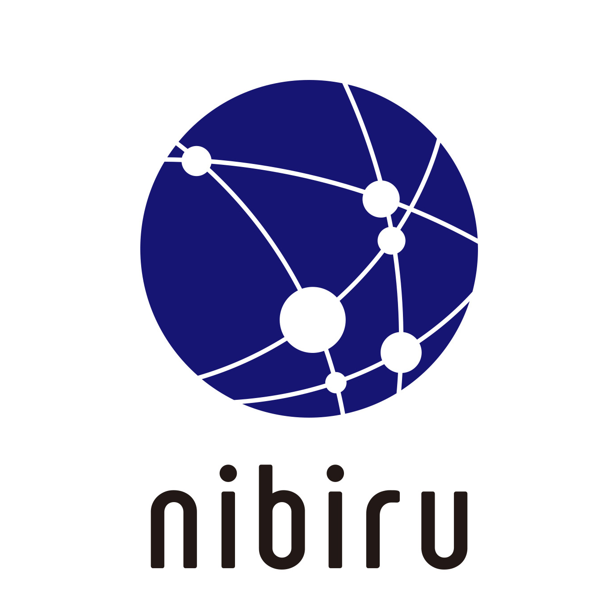

# nibiru

<p align="center">
  
</p>

[](https://github.com/cosmos-gaminghub/nibiru/releases/latest)
[](https://goreportcard.com/report/github.com/cosmos-gaminghub/nibiru)
[](https://golangci.com/r/github.com/cosmos-gaminghub/nibiru)

**WARNING**: Nibiru is under VERY ACTIVE DEVELOPMENT and should be treated as pre-alpha software. This means it is not meant to be run in production, its APIs are subject to change without warning and should not be relied upon, and it should not be used to hold any value.

# Quick Start
Go 1.13.0+ is required for the Cosmos SDK.

```bash:
$ git clone github.com/cosmos-gaminghub/nibiru.git
$ cd nibiru && git checkout master
$ make install
```

Try `nbrcli version` and `nbrd version` to verify everything is OK!

## **Initialize configuration files and genesis file**

Just use shell scripts bellow.
```
$ sh scripts/start.sh
```

Or you can follow the command.

```bash
$ nbrd init eguegu --chain-id testchain
```

**Copy the `Address` output here and save it for later use**

```bash
$ nbrcli keys add jack
```

**Add account with coins to the genesis file**

```bash
$ nbrd add-genesis-account $(nbrcli keys show jack -a) 100000000nbr,100000000stake
```

**Configure your CLI to eliminate need for chain-id flag**

```bash
$ nbrcli config chain-id testchain
$ nbrcli config output json
$ nbrcli config indent true
$ nbrcli config trust-node true
```

```bash
$ nbrd gentx --name jack
$ nbrd collect-gentxs
$ nbrd validate-genesis
```

**Now let's start!**
```bash
$ nbrd start
```


## Use docker

```bash
$ docker build -t nbr .
```

```bash
$ docker run --rm -it nbr sh
```

```bash
$ docker exec -it nbr sh
```

## 4 validators local private net

```bash
# Work from the nbrchain Repo
$ cd $GOPATH/src/github.com/cosmos-gaminghub/nibiru

# Build the linux binary in ./build
$ make build-linux

# Build nbrchain/nbrdnode image
$ make build-docker
```

### Run Your Testnet

To start a 4 node testnet run:

```bash
$ make localnet-start
```

This command creates a 4-node network using the nbrdnode image.
The ports for each node are found in this table:

| Node ID | P2P Port | RPC Port |
| --------|-------|------|
| `nbrnode0` | `26656` | `26657` |
| `nbrnode1` | `26659` | `26660` |
| `nbrnode2` | `26661` | `26662` |
| `nbrnode3` | `26663` | `26664` |

To update the binary, just rebuild it and restart the nodes:

```bash
$ make build-linux localnet-start
```

### Keys & Accounts

To interact with `nbrcli` and start querying state or creating txs, you use the
`nbrcli` directory of any given node as your `home`, for example:

```shell
$ nbrcli keys list --home ./build/node0/nbrcli
```

## License
Licensed under the [Apache v2 License](LICENSE).
